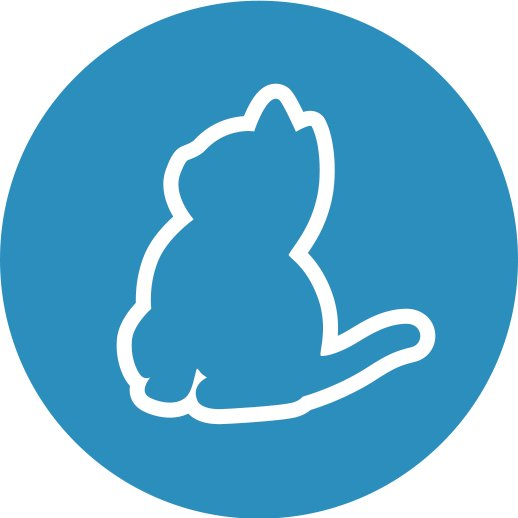

<div style="display:flex; align-items: center">
  <h1 style="position:relative; top: -6px" >inews - news website</h1>
</div>

---

### Screenshot


A news site is a platform where you can read news about politics, society, and sports. The app language is Georgian. It features a search functionality, dark/light theme mode, and also an admin functionality. If you register and authenticated with laravel sanctum, you will have permission to access the admin panel and create, edit, or delete news.

#

### Table of Contents

- [Prerequisites](#prerequisites)
- [Tech Stack](#tech-stack)
- [Getting Started](#getting-started)

### Prerequisites

-  _Node JS @12.X and up_
-  _Yarn @1.X and up_
-  _npm @6 and up_

#

### Tech Stack

-  [React @18.2.0](https://reactjs.org) - front-end framework
-  [Tailwind CSS @3.2.4](https://tailwindcss.com/) - CSS framework
-  [React Hook Form @7.41.3](https://react-hook-form.com/) - library for form validation

#

### Getting Started

1\. First of all you need to clone Covid Questionare repository from github:

```sh
git clone https://github.com/datomaluta/inews-front.git
```

2\. Next, go to app directory with this command

```sh
cd inews-front
```

3\. Next step requires install all the dependencies.

```sh
npm install
```

or

```sh
yarn
```

4\. after that you can run application from terminal:

```sh
npm run dev
```

#
